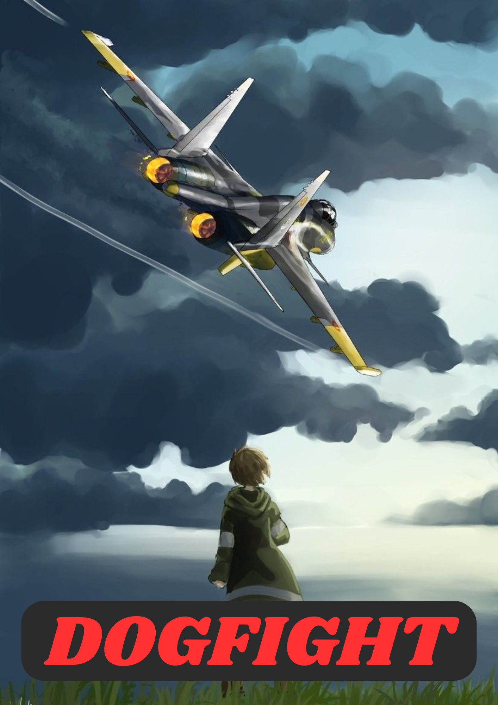

# DOGFIGHT



## Introduction
Welcome to **DOGFIGHT**, a 3D action game built using the Bevy engine. The game simulates an immersive environment where players control their aircraft, navigate dynamic worlds, and engage in aerial dogfights. This project integrates cutting-edge features such as a third-person camera, advanced physics, and modular game architecture.

---

## Features

### 1. **Third-Person Camera**
The camera system, implemented in `camera.rs`, provides:
- Dynamic aim adjustment.
- Zooming capabilities.
- Smooth transitions and offsets for immersive gameplay.

### 2. **Player Mechanics**
Defined in `player.rs`, the player mechanics include:
- Realistic player movement.
- Integration with a 3D model (`Player.glb`).
- Responsive controls for navigating and interacting with the world.

### 3. **World Environment**
Managed in `world.rs`, the game world features:
- A detailed 3D map (`map.glb`).
- Lighting adjustments for dynamic and engaging visuals.

### 4. **Physics Integration**
Physics are powered by the `bevy_rapier3d` plugin, enabling realistic movement and interactions.

### 5. **Performance Monitoring**
Using the `iyes_perf_ui` plugin, the game includes performance diagnostics such as FPS tracking for optimization insights.

---

## File Structure

```
DOGFIGHT/
├── src/
│   ├── camera.rs          # Third-person camera system.
│   ├── main.rs            # Game entry point.
│   ├── player.rs          # Player controls and movement.
│   └── world.rs           # World environment setup.
├── assets/
│   ├── image/DOGFIGHT.png # Project cover image.
│   ├── map.glb            # 3D map for the game world.
│   └── Player.glb         # 3D player model.
└── README.md              # Project documentation.
```

---

## Prerequisites

- Rust (latest stable version)
- Bevy Engine (`bevy` crate)
- Additional dependencies:
  - `bevy_third_person_camera`
  - `bevy_rapier3d`
  - `iyes_perf_ui`

---

## Installation

1. Clone the repository:
   ```bash
   git clone https://github.com/your-username/DOGFIGHT.git
   cd DOGFIGHT
   ```

2. Install dependencies:
   ```bash
   cargo build
   ```

3. Run the game:
   ```bash
   cargo run
   ```

---

## Controls

- **W**: Move forward
- **S**: Move backward
- **A**: Turn left
- **D**: Turn right

---

## Contribution
Contributions are welcome! Feel free to fork the repository and submit a pull request.

---

## License
This project is licensed under the [MIT License](LICENSE).

---

## Acknowledgments
- Special thanks to the creators of Bevy and its community for their incredible support.
- Credits to the developers for their hard work on the **DOGFIGHT** project.
